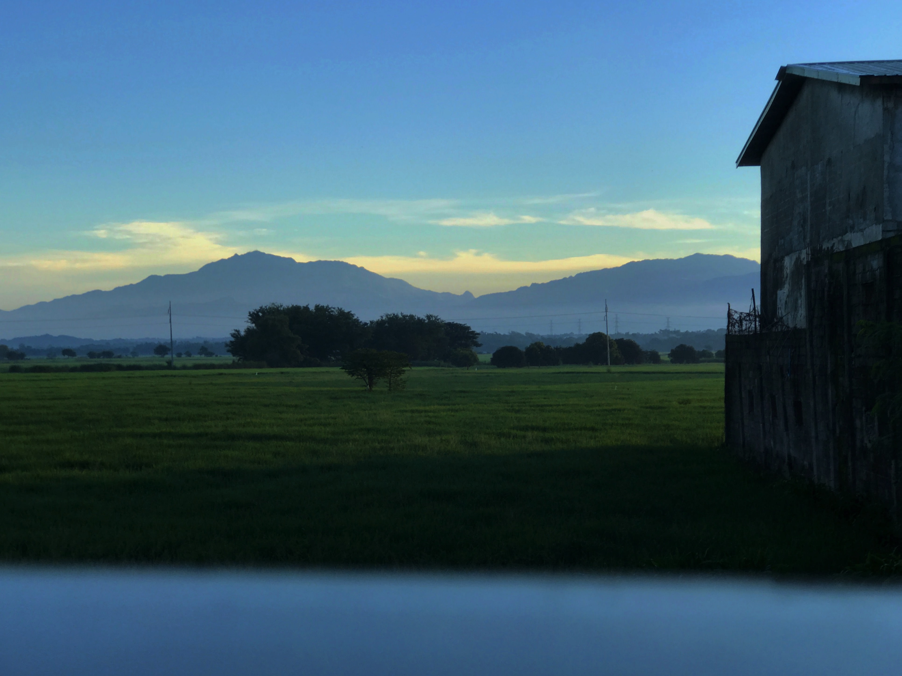

> “The morning, which is the most memorable season of the day, is the awakening hour. Then there is least somnolence in us; and for an hour, at least, some part of us awakes which slumbers all the rest of the day and night... All memorable events, I should say, transpire in morning time and in a morning atmosphere. The Vedas say, “All intelligences awake with the morning.”
>
> \- Henry David Thoreau, _Walden_

My mornings are a no brainer. It starts when I wake up. For some reason, I wake up at around 6 am every day, without the use of an alarm.

Before I even wake up, usually Chikako, our youngest dog, is at the foot of the stairs waiting for me to call her. I play with her on my bed for a while. This begins my day. After this, I make my bed then drink two glasses of water.

Then comes the more "sacred" part of my morning.

I retreat inside my room and do some _asanas_ or yoga postures. It's a gentle succession of postures I took from the book _The Heart of Yoga_ by T.K.V. Desikachar. The _asanas_ are meant to prepare one for breathing meditation. I've been following the same sequence every morning for the past three years and I've modified some parts of it.

The more popular sun salutations sequence is also a good simple and short sequence that one can easily integrate into any morning routine. What's great about the sun salutations is that it targets the major areas of the body making it a perfect option for busy people.

After yoga, I sit on my mat and write on my [Five-Minute Journal](https://www.intelligentchange.com/products/the-five-minute-journal). I am on the track of keeping a daily morning and evening journaling practice for about a year already, thanks for this journal. I currently use the mobile app as it's easy to use and has an option to include a photo of the day. Sometimes, when I get really inspired, I write something in my physical journal.

After a short journaling session, I read a few pages from a good book. My standard for a "good book" to read in the morning is not something too heady. I love reading heady stuff—academic books, philosophy books, and science books—but not in my morning routine. As I'm writing this piece, I'm currently going through Jon Kabat-Zinn's _Wherever You Are You Are There_. I find the book perfect for my morning routine as it's easy to read, "devotional" and reflective in some sort, and it's divided into really short parts which I can bite through for a few minutes every morning.

After reading, I lay down on the mat for a few minutes of breathing meditation. This usually ends my morning routine.

Right now, I'm thinking about adding blogging into the mix. I want to start and maintain a blogging practice and it makes sense to stack blogging over my already established morning routine.

Mornings are great because we usually have more willpower and energy during this time of the day compared to afternoons or evenings. It's a great time to put ourselves in the right direction for the rest of the day. It's a great time to devote ourselves to the things that really matter to us.

In starting a morning routine, I find the website [mymorningroutine.com](https://mymorningroutine.com) and Hal Elrod's book _Miracle Morning_, great resources.
