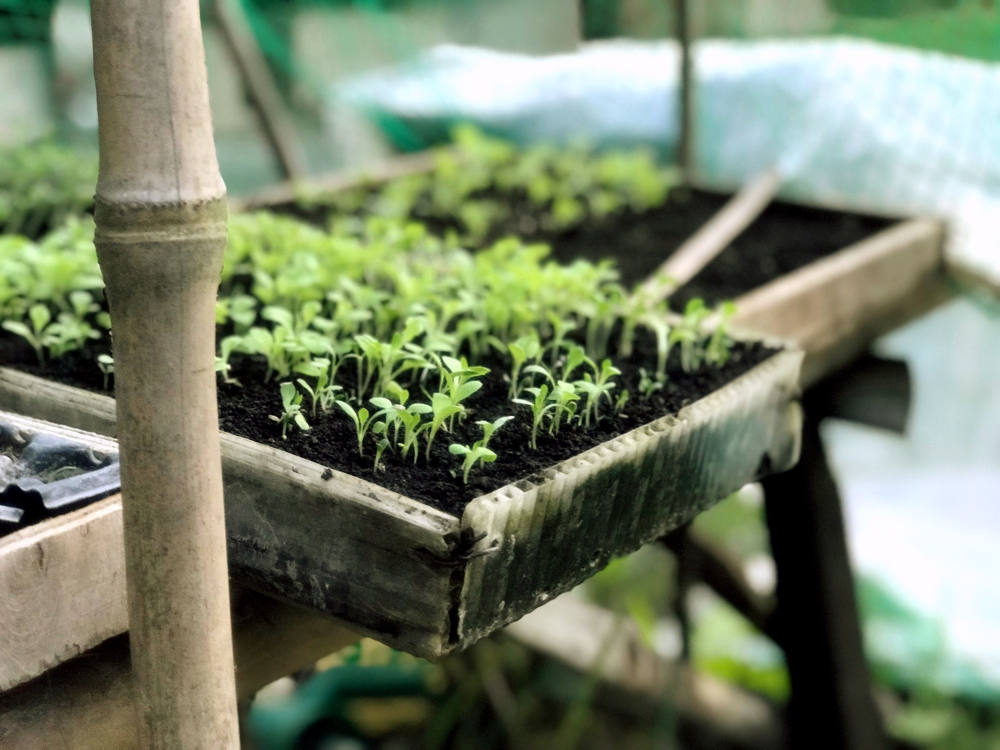

Why do we continue to love even after we are hurt?

Why, even when we’ve witness a love one die or drift away, we lick our wounds, only to find ourselves in new relationships—some of which, if not all, will be gone again?

Why do we deliberately choose to put ourselves in places where we might eventually get hurt?

I intuit that the very things that “might” hurt us are also the very things that give us the only real chance to experience true joy.

A rational individual, might reason that in his worldview there is no room for faith.

But to live without faith, without trust, without a zest for surprise, is to not live at all.

I ask myself, why do I ride my bike on the road, amidst fast-running ten-wheeler trucks and reckless bus drivers?

Why do I deliberately choose to put myself in a place where countless innocent lives are taken every hour?

It’s because I choose to live, to live a life that is full, to live unafraid.

This place, where fear does not reside, where courage is born instead, is a place nurtured by faith, nurtured by trust.

It is faith independent of religious beliefs. It is simply faith, that whatever the outcome of my actions, I am strong enough to face them.

I turned 27 last February. I am still young in the eyes of most people. But deep inside, I feel very, very old. Having gone through a lot of suffering and going through them with a very sensitive mind and body, there are times when I honestly feel like I had it.

I feel like I’m no longer ready to take on another fight.

I’m no longer putting myself in places where I might be hurt.

I’m staying put.

Here.

In this hole I’m digging.

In oblivion.

When I am in this space, of lifelessness, days seem to be so long. Routines are shattered. And escape is the most logical thing to do.

It is a place of weakness.

Of numbness.

Of an inability to trust, to have faith, to be courageous, and, therefore, to continue.

Life becomes simply a quick detour towards death.

In this circumstance, the body and mind slows down.

And this is when something radical happens.

When all is done.

When all that makes sense is to live within the cold confines of disbelief.

When the body and the mind refuses to respond to any form of stimulation.

A “deep rest” ensues.

A humble return down to earth. To _humus_.

Deep down to that which resides within.

A mysterious calm visits.

Most people miss this inner miracle.

Before they see this happen within them, they have already thrown the towel.

But it is a place where a complete reversal of the dark descent begins to occur.

It is a fertile soil where new seeds of faith, of trust, and of courage germinate.

For me, such miraculous moments take the form of a beautiful sunset, a quiet morning, a delicious meal, or a rejuvenating conversation with a dear friend.

Sometimes, they even take the form of written words, of captivating artworks, of soothing melodies.

Whatever form they take, they bring peace, stability, and calm.

Calm enough for one to see possibilities.

Calm enough for one to see that one can still move through life.

I am old enough to understand that life is nothing but a game of acquisition and loss. We gain things, but we also lose them. Thus, to live is almost always to bring one’s full presence on moments of joy, when one has things, and to bring that same full presence when one loses them.

One’s learned capacity to go through this ebb and flow of life is what saves our lives from self-annihilation. It is what brings hope. It is strength.
