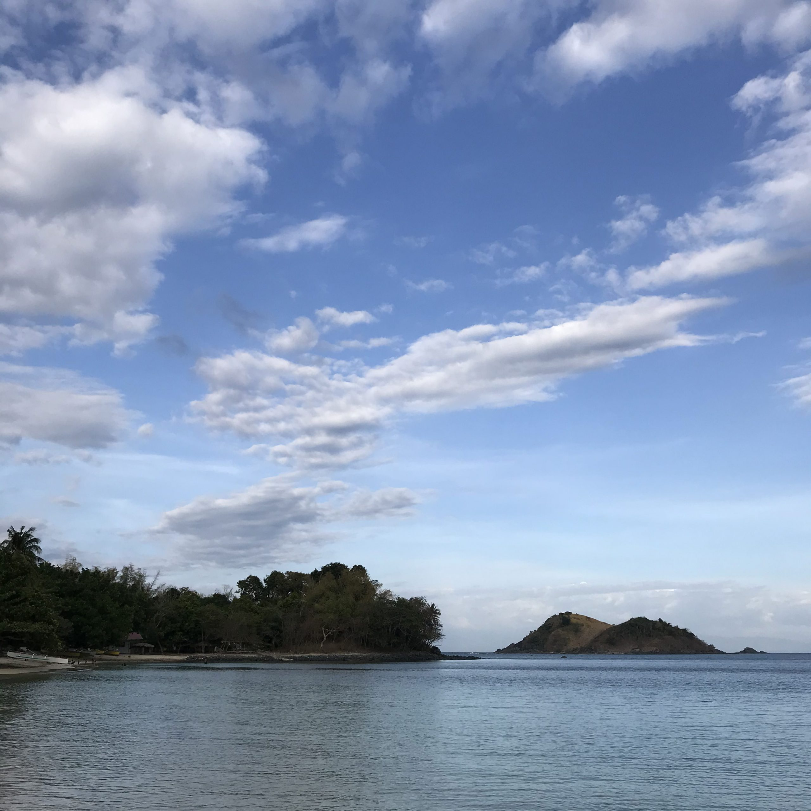

I sat at the farthest seat at the back of the Anfra. The one near the lock of the backdoor. I like this position. It allows me to stretch my legs on the long bench-like seats of the Anfra while I look out the window. My sister sat on the other side, parallel to me, doing the same thing: stretching out her legs and looking out the window. I opened my window as wide as it can and felt the cold breeze blow strong on my face as the vehicle started moving. I felt good.

By the time we reached the beach, the sun is about to set. Probably, about twenty minutes before it's gone. I walked towards the little waves and let them tickle the tiny spaces between my toes as the sand beneath my feet slowly gushed back to the ocean. The breeze is colder and stronger here than on the road, but it didn't feel as consoling. What feels really consoling is the water. Not the tickle of the waves but just the presence of water. Perhaps, even the sound of it.

I felt good.

After a long time, I felt _really_ good.

There was a time in my life when I didn't feel anything—not sadness or happiness, nothing.

This is what depression and the drugs that attempt to cure it do—they numb that part of you that feels. Depression is not sadness. It is the absence of sadness—and all other emotions.

As my brain slowly healed, I started noticing how little things and actions generate feel-good experiences. These are things and actions I used to overlook—things like the cold breeze or the presence of flowing water. Today, exposing myself to these things and taking tiny actions that immediately make me feel good form a large part of what I do every day.

I realized that everything we want—our goals and aspirations—are desired not for themselves but for the _feelings_ that they generate. We work not for money and not even for what money could buy but for the _feelings_ and _experiences_ that are generated by what money could buy. We don't realize this often but what we really desire in life is to feel good.

Worse, what we don't often realize is that it doesn't take a lot of work, time, or money to actually feel good. Of course, taking care of our finances, finding work we love, or taking time to nurture good relationships all create external situations where good feelings are easier to generate. However, it doesn't mean that we need to wait long or work hard just to feel what we want to feel.

There are simple, tiny actions we can do to feel good _now_—tiny actions like spending time in nature where air and water could console us. These are actions that help us access our emotions _directly_ thus generating our desired states of mind _immediately_. If feeling good is the ultimate goal, then perhaps these shortcuts to feeling good should always be our priority.

This is ultimately the reason why I will always be a fan of self-care practices like meditation, yoga, journaling, proper nutrition, sleep, being in nature, and exercise. All of these generate good feelings almost immediately after they're performed. There is no need to wait years to experience happiness or _Ginhawa_ (the indigenous Filipino concept that captures integral well-being). These feelings are just one breath, one asana, one journal page, one nutritious meal, one good night sleep, one walk at the beach, or one workout away.

What's more, establishing a strong foundation of tiny feel-good practices prepares us to tackle the larger, more complex projects that we need to take on. And if a big tragedy occurs—which always does—we're better prepared for them.

Practices that let us access Ginhawa directly makes us more capable and resilient individuals.
