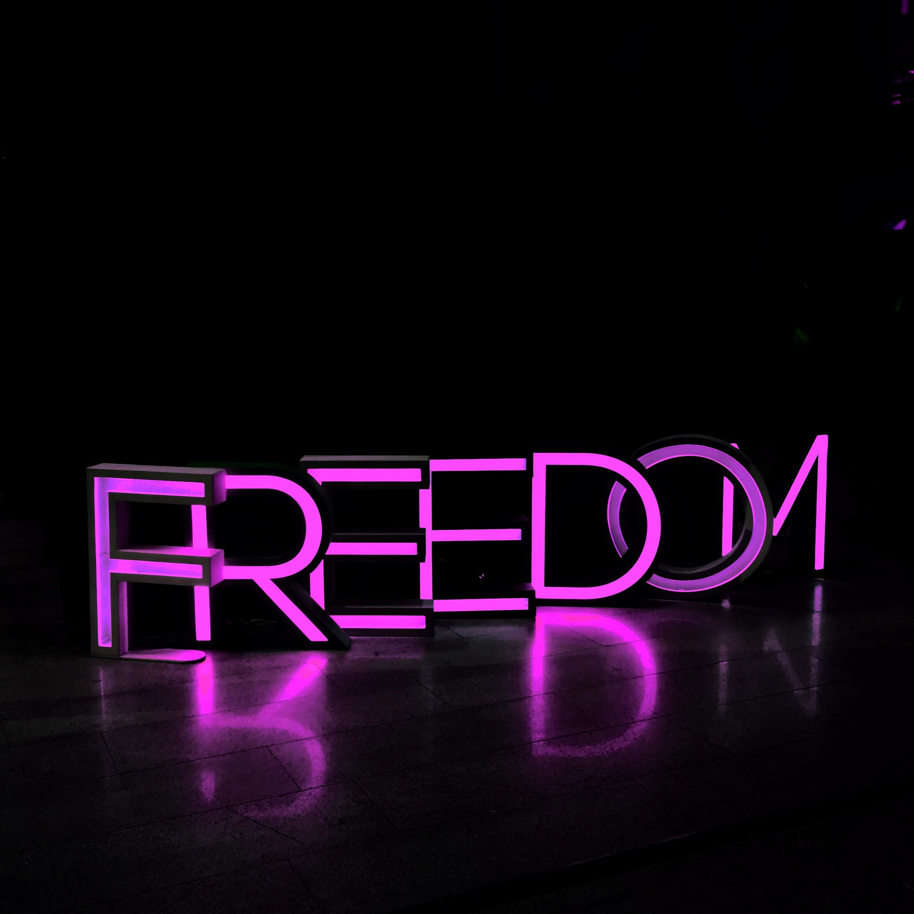

My argument is that financial freedom, if its definition is put through the scrutiny of philosophical analysis, will become something that is achievable today⁠—not on years ahead.

Financial freedom is a state.

A state is the condition of X at any given time. This follows that X could have different states at any given time.

A human being, at any given time, is at a particular state. This state can be described as having two parts: one external, one internal. His external state is the condition of his physical body. To understand financial freedom better, we can also extend this external state to include the condition of material things around him. On the other hand, his internal state is his mental state⁠—what goes on inside his mind at any given moment.

We can think of financial freedom as an overarching idea that our mind constructs to make sense of this combination of internal and external states. _**Financial freedom is simply a state where and when a human being could take any action without the purpose of making money.**_ This means that action, no matter what its nature, when done for a purpose other than to make money can be said as taking place in a state of financial freedom.

There is a similarity between the states of one person drawing a picture without any intention of selling it because his financial needs are already being taken cared of by his investments (Person A) and the state of a similar artist drawing a picture without any intention of selling it because he has time to spare outside of working hours (Person B). Their only difference is the amount of freedom each has or, more accurately, the potential duration each person has to stay in a similar state to where they currently are. Person A can stay in a similar state for as long as he wants (i.e. continue to draw his picture) because he doesn't have to go back to work while Person B has to take some form of action that involves money-making in order to survive.

My point is that financial freedom, as a state, is actually more accessible than we think. What isn't easily accessible is the external conditions that could create more similar states. It is easier to carve a block of time after work to enjoy a non-money-making hobby than to wait for all your investments to work for you so that you can do the same hobby.

What are the benefits of thinking of financial freedom this way? For one, the definition helps you really dig deep on what you are really aiming for when you say you want financial freedom. If what you are aiming for is the freedom to engage in a creative endeavor, do you really need to wait years when your investments are already working for you before you start? Or would it be better to remember that you could die any time and that it might be wiser to set aside some time in your days or weeks to start doing something you really care about _now_?

People who keep their expenses low so that they work fewer hours have more moments of financial freedom than those who spend a lot and, therefore, work a lot. The former may not have total financial freedom, but they have ["enough"](/kasapatan-pagpapaubaya-kapayapaan/) financial freedom to do things they actually care about _now_.

Artists don't have to put off their art to focus on making money for themselves first. If they look at financial freedom as a state that can be replicated and inserted at any time of the day, [they could start what they want to do _now_](/creative-freedom-is-all-that-matters/).

Clarifying our definitions of things makes us think about them more, shedding light on not very obvious truths and insights. This is why I really love [philosophy](/minimum-viable-worldview/). It just makes me a better human being.
