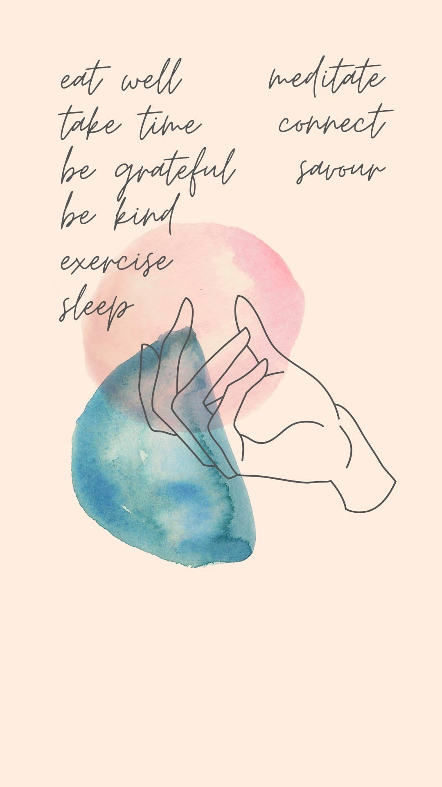

I parked my bike under the shade of a small stout tree. It looks small from where I am standing because I am elevated around three or four feet from its roots. I am standing on concrete. This path has been cemented in the past year or so and this tree is one of the few lucky ones to avoid the teeth of the chainsaw. I am grateful for it for I was yet to attach the stand on my bike. I rested my bike on its rough trunk.

It's 6:30 pm. Everything was already dark. The days have been shorter and the evenings longer. I have to readjust my afternoon rides if I want to catch the sunset—a feat I find so difficult to do. I have gotten so used to going out at 6 pm that I’ve forgotten it is no longer March.

I looked at the large lights from afar. They are lights on the highway across this vast field of dark green. Smaller lights moved below these larger lights—one after the other like bowling balls.

A feeling started to seep in while I saw all of these—the feeling that I’ve had since this morning and which I tried to escape from. It is the feeling that I am “still” lacking something—a feeling of failed expectations.

## Familiar Doldrums

Today marks the end of several months of trying to construct a [life system](https://www.evernote.com/l/AiGNBsNe_w1C4bjGxBluu_kElfrJ9-0HrDA)—an integrated productivity, knowledge management, and total life system. It has been a fulfilling, revealing, and exciting project to build. It’s much needed too because for so long I have been unable to organize my life in a way that totally made sense to me. Being someone who admires and “needs” organization, not being able to do this meant years of procrastination and psychological stress. I was able to address this mental burden in the past three months or so and I have a functioning minimum viable life system to show for it.

I know that it is already achieving what it was built to do because I am feeling less anxious about it. I am ready to move on for the next project.

But then, I was surprised to find myself in these familiar doldrums at the end of large pursuits. I first experienced the doldrums after launching -_Tanaw_, the free ebook I created by compiling the answers of several awesome people on three questions that I was pondering on. I expected a feeling of jubilation, of joy, of rupture at the end of the project, only to find myself in a place of bland emptiness. This feeling always left me doubting myself and my efforts. It makes me feel like I wasted all my time doing something that wasn’t giving me the happiness I expected it to provide. I know that swimming and diving into this feeling would leave me afraid of pursuing new projects that may also fail to make me happy, so I try to avoid this feeling, to escape it, and to move on.

But the feeling won’t go. And I have grown old enough to know that feelings like these won’t go unless they’re confronted head on.

## What Truly Makes Us Happy

Looking at the large and small lights from afar made me realize (or, more accurately, made me remember the lesson I learned months ago from Laurie Santos’ enlightening course [“The Science of Well-being."](https://www.coursera.org/learn/the-science-of-well-being)

The things we think will make us happy are not the “direct” paths to happiness. Usually, they are simply scaffoldings that allow happiness to possibly emerge. But by themselves, they will not generate the feelings we are asking them to generate.

I felt empty because I was looking for a quick fix to all my emotional hurdles (many of which were worsened by the pandemic). I completely forgot that happiness is so fleeting that it needs to be revisited constantly, generated not by big projects but by small actions and habits.

What are these habits?

Here’s a wallpaper created and shared by a [fellow student](https://www.facebook.com/groups/happinesslab) of the course listing the habits that generate happiness. It is the wallpaper I use for my phone.

- **Exercising, eating, and sleeping well.** Food, being physical, has a direct influence on our mental states. This is the reason why eating certain foods can make us feel groggy while eating others make our minds sharper. Likewise, exercising and sleeping enough a day have direct effects on our mental well-being. This is so obvious but we don’t always make these three things our priority.
- **Taking time.** Our society has glorified material affluence when what really makes us happy, according to science, is time affluence. Material affluence should allow us to have more time because this is what matters more—the freedom to do what we want to do when we want to do it or the freedom of just not doing anything at all! Being too busy is not always good for us.
- **Being grateful.** Gratitude has an immense influence on our general well-being, so immense that even writing a gratitude letter to someone you love and reading that aloud in front of him/her in person could raise your well-being by a large margin for more than a month!
- **Meditating.** Meditation is something that a lot of people are unwilling to do. Two reasons prevent them from exploring this powerful tool: it is difficult and it is frequently associated with Eastern religious beliefs. Fortunately, one can benefit from meditation without having to light an incense or sing chants. It is also not as difficult to do as some teachers describe it. Even reconnecting with one’s breath for a second can have massive effects on one’s internal state. I have so much to say about this but will leave it for a future post.
- **Connecting.** Connecting with loved ones and striking up conversations with strangers have a direct impact on our happiness, according to science. Granted, it is not easy to take care of this area of our life (or at least, for introverts like me, it isn’t easy). But taking care of our social connections especially during this time of social distancing is critical in preventing depression and other mental health problems. If you are a natural connector, you have a duty to build spaces where people can connect during these difficult times.
- **Savoring.** Savoring correlates with meditating. Savoring is like bringing the spirit of meditation into every important moment of one’s life (if we are being truly honest, this means every single moment of our life!) Whether it’s looking longer on the leaves falling from a tree, eating slower to connect with every taste in our food, or making the most of the days we spend with the little children in our lives (who will soon be teenagers and adults!), savoring directly generates happiness.

The science shows that once these tiny actions are covered, a person should expect his or her well-being to drastically improve. But the linchpin is to turn these into habits—actions we repeat and revisit. The reason why we need to continuously do them is because of the very nature of positive mental states like happiness or flow. Like any emotion really, happiness is fleeting. It shows up then goes. We know it’s good for us so it has to be pursued but we need to make some effort. Fortunately, these habits are small and doable as compared to the big projects that we are expecting will make us happy (getting married, buying a new car, getting a raise, etc.)

## The Right Goals

We don’t realize this often but there’s a big possibility that we are going after the wrong goals or maybe the goals we set for ourselves are good and worthy goals but we are expecting a lot from them or we are expecting the wrong things from them.

Building a productivity system, I learned, produces a sense of control and calm. Building it is still a worthy pursuit. I will share my journey in building it at another time.

However, building a life system doesn't make one happy at least in a way that one expects. It is still possible to build a life system and feel awful afterward (like what happened to me) because the feeling of being in control and hitting one task after another in an organized way is not a direct path to happiness. It helps construct a place where positive emotions can flourish. But, by itself, it does not necessarily enhance well-being.

What enhances well-being are habits—the tiny little actions that we do and revisit regularly, which reconnect us with the mental states that we’re looking for. These actions are the content that fills up whatever life system we build for ourselves.

Now that I have a minimum viable life system in place, it's time to make good use of it by pursuing the more important goals that directly translate to happiness.

Yesterday, I messaged my tribe asking them to set aside time twice a month for an accountability call. This regular meeting will definitely increase my well-being. It took me just five minutes to set something that I know will make me happy for the weeks to come. Compare that to the three or more months I spent fixing my system!

Raising the level of our well-being, especially as we continue to tread through this pandemic that has been very, very long is the most critical project we should all engage in in the following months. It is what I choose to dedicate my time next. As always, I will write about my learnings and share them with you.

Thank you for always reading and I hope this has been useful.
