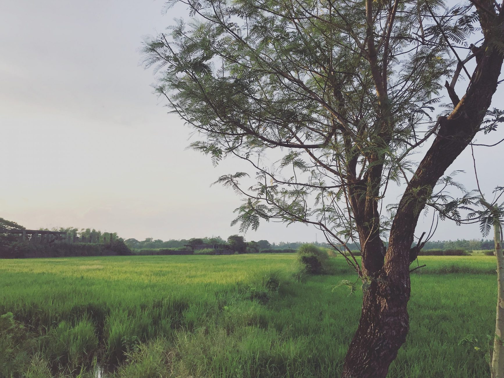

The film [Paterson](https://www.youtube.com/watch?v=m8pGJBgiiDU) inspired me to write a poem after a long time of not being able to do so. For anyone who hasn’t seen the movie (you should), it is about a poet who writes really good poems but doesn’t want to publish them. It is a great parable for the tension between the artist as the Self and the artist as a performer.

What really struck a chord in me was how the poet existed in his everyday life. I felt like he had poetry goggles: everything he saw and experienced was fodder for his art.

## A Way of Seeing

At about the same time, I listened to an interview with [Alain de Botton](https://philosophybites.com/2007/11/alain-de-botton.html) about his unconventional way of writing philosophy. When asked what he thinks philosophy was, he said that it is a way of seeing things rather than a topical category. What I understood from his perspective was that things don’t become philosophical just because they are concerned with problems like, perhaps, the existence of God or the soul. They become philosophical because we look at them then talk about them in a manner that is philosophical—we ask, we reflect, we extrapolate, we provide arguments, then we make conclusions. Philosophy is about a way of seeing things than a way of saying them.

I think the same can be said about poetry. The hero of Paterson (who, by the way, was a man named Paterson living in a place called Paterson—what poetry!) saw everything as poetic. Then he described what he saw through poetic language. What was amazing about Paterson was that he can’t remove that lens through which he saw things. It was built-in and, therefore, defined every single moment of his existence.

## "There" and "Here"

My gut says that there is just a subtle difference between seeing the world in a poet’s lens and seeing it in a philosopher’s lens. It is subtle because I believe, based on my own experience, that both lenses really want to make sense of the world and our relationship with it. Both lenses are existential. The biggest difference between the two is objectivity and subjectivity. While the philosopher desires primarily to see what is really “there”, the poet desires primarily to see what is really “here”. In other words, the philosopher hungers to know about reality. The poet hungers to know about how we experience that reality.

And this translates with how the poet and the philosopher “say” things. When I am wearing my philosopher’s lens, I am primarily interested in accuracy. I am careful not to make claims hastily, I use direct language, I am more humble and honest, and I don’t say I am sure about something I am not.

On the other hand, when I am wearing my poet’s lens, I care more about authenticity than I am about accuracy, I am fine with sacrificing carefulness for genuineness, I use metaphors, and I don’t care about making grand claims about things I am not sure about. It is okay for me to lie if that means I am able to be true to my experience.

## Philosophy and Poetry are Complementary

Of course, it is not impossible to take on both lenses. In fact, they are complementary. In my quest for truth, philosophy is my primary lens. It is more honest and careful. It is more trustworthy. But in transmitting that truth to others, I use the poet’s lens (or perhaps more accurately, the poet’s microphone), because poetry’s strength lies in the way it says the truth. I can still be accurate in my description of truth, I can still be careful, but I can also be freer and more colorful in my description of it. I can be more poetic.

In both cases, philosophy and poetry cease to be topical categories boxed inside academic departments. They become ways of living—a personal religion if you will. And, in fact, what they really are are simply descriptions of innate capabilities we are born with—two ways of operating that define what makes us human.
