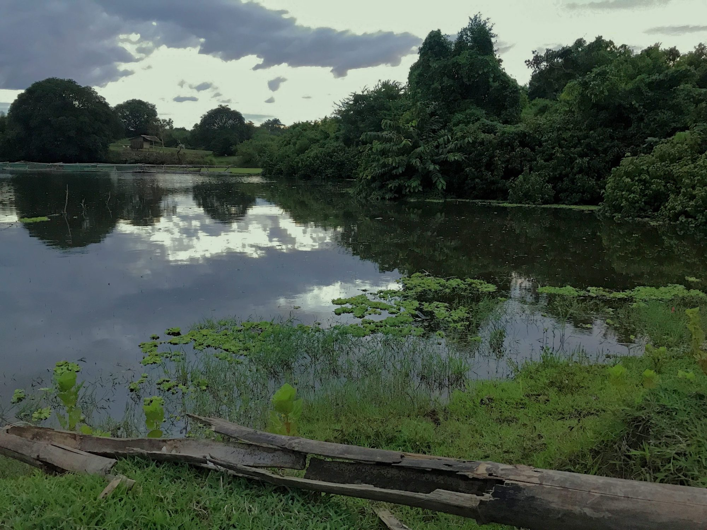

The Buddha know this.  
This is where history unfolds.  
Not in the battlefields.  
Or the great works of art.  
Or breath-taking inventions.

History happens at this moment,  
then the next,  
and the next.  
Nowhere else.

No one can watch history unfold  
but one who lies down under the stars,  
who sits still in front of a lake,  
who stands above a sea of clouds.

And who, like a dazzled spectator  
of an animated movie,  
watches each slide pass by  
slowly  
one by one.

Breathe in.  
Breathe out.

Breathe in.
