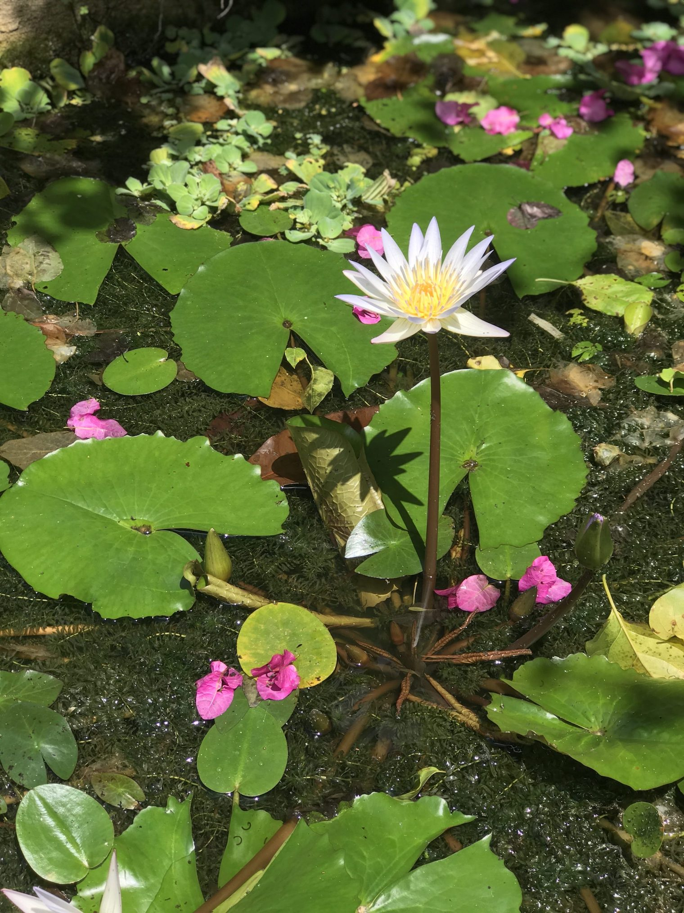

I have always wondered why even the most enduring religious, spiritual, philosophical, or psychological traditions can not put an end to violence, why these cannot inspire everyone to show kindness and compassion once and for all.

I think what is imminent from this is that human personality is too complex for a single tradition to claim to be able to influence. A one-size-fits-all approach to transforming people from being selfish and violent to selfless and compassionate is always doomed to fail.

The things that many of us (even atheists) aspire to—compassion, kindness, love—are things that are not “given”. They are nurtured. Yes, we were born with the capacity to show them (as we are to not show them), but they don’t flourish by themselves. To grow, they need to be revisited and reenacted. In other words, they have to be practiced.

Now, that nurturing starts from childhood. The [science](https://greatergood.berkeley.edu/article/item/how_much_of_your_happiness_is_under_your_control) shows that our genetic make up makes us predisposed to certain emotions. I, for example, think that I am genetically prediposed to sadness and anger because, based on self-knowledge and how I scored in the [Big Five Personality Test](https://openpsychometrics.org/tests/IPIP-BFFM/), I am moderately high in neuroticism. On the other hand, those of us who are more extroverted have a better chance of experiencing more positive emotions.

Most of our parents will never know this. Most of them won’t be able to build a custom-made program to raise us in a way that targets our genetic flaws. The tools and styles they used to raise us are all based on what they knew, which were from their parents too. They think that raising a child is a no-brainer, that it only takes common sense to do it—work hard, earn money, and provide material needs to your children and you’re good. But obviously, that is a very deficient view of parenthood.

An ideal parent is like a true professional, who should update their knowledge about best practices in their profession and then apply those. But most parents don’t see parenthood as a profession and our society look down on stay-at-home parents. Most of us, especially the parents themselves, don’t see that what they are doing is perhaps the most important job in the world.

Childhood is not our only shot in constructing a better, more compassionate world, but is is a very critical shot—it is the foundation of all our efforts. Of course, even a perfectly raised child could enter the world and see how ugly it is. It could shake them up and make them unlearn everything they knew growing up. But at least, they have something to look back to—a reference and reminder of what is possible.

Children who were raised in a kind, compassionate household have a first-hand experience of what a kind, compassionate environment is. They know that it is possible because they lived in it. Not all of them can be saved when they start entering society. But some of them will.

We only have two battlegrounds: home and society. The majority of us will never be able to influence society. Even democratic processes that suppose to give us power are easily manipulated by the already powerful. And anything that an ordinary citizen can do to influence society can easily be eclipsed by larger, richer, and more influential entities.

But when one takes the role of a parent—an adult that guides young human beings—they don’t realize this often but they just received a very critical privilege of constructing a mini-society inside their own home, a place where government and civic society has less power over.

A home is a little society, which parents can either turn into a democracy or even an anarchic society where children are allowed to follow their own passions, as what happens in unschooling families.

Now here is where Nature becomes a powerful tool for parents to tap. [Nature helps little human beings be more compassionate](https://mountainjournal.org/in-a-time-of-violence-nature-helps-empthy-grow-in-kid). Personally, when I am in nature, I am able to calm down, generate more positive emotions, and process negative emotions better. When I'm down, feeling antsy, or annoyed, I just walk. That's the reason why I cannot live in a place with no trees and nature-filled spaces.

And what I find when I walk is that it is just so difficult to hate someone else when you are faced by a beautiful sunset or a star-filled sky enveloping you from above.

Parents can incorporate regular nature visits to parenting. A complete retreat from modern society and communion with nature is one of the best tools we have in raising children who would be more resilient when faced by the violent and less compassionate society.

Parents should never take parenting lightly—nor nature for that matter. We should make the most out of these two tools. It might be our only chance for building a more beautiful world our hearts know is possible.

Until next week,

Vince

\*\*\*

P.S. I am not a parent, but I’m an unschooling proponent and this connection between childhood and nature fascinates me. If you are a parent, I would love to know your thoughts about the ideas I mentioned here. Non-parents like me are also welcome to share their.
