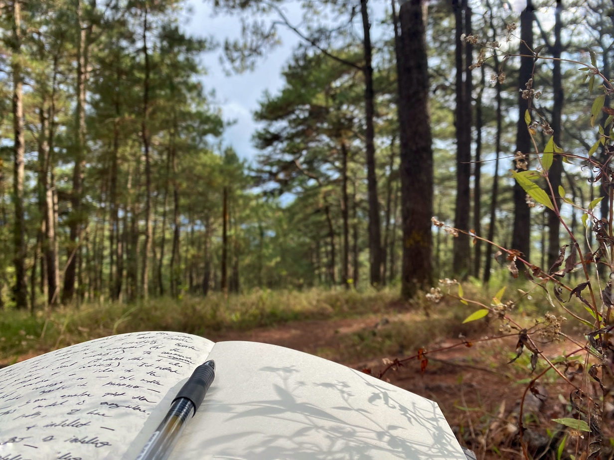
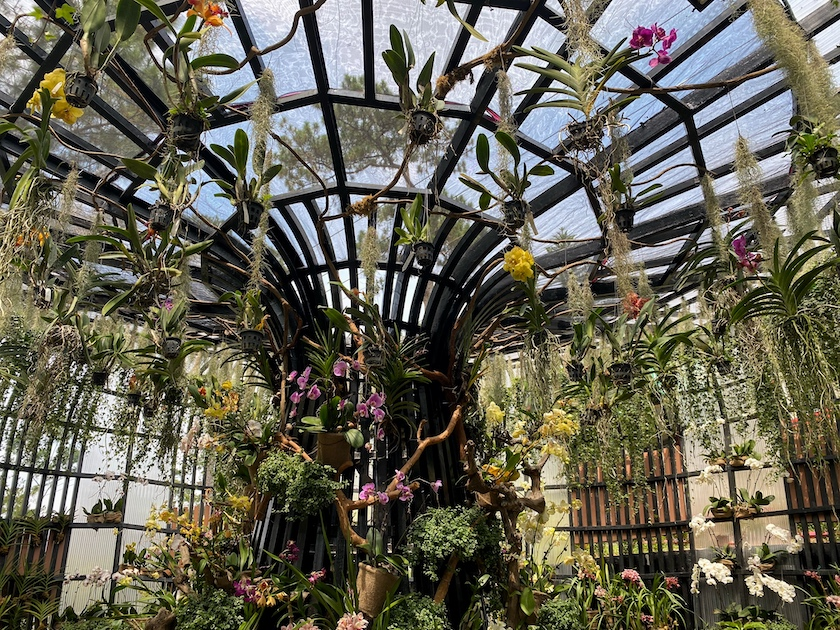

The summer heat has arrived in all its double-edged glory. First, you see it in the greenery. Plants and trees are flowering, yet leaves are also withering. Then you can feel it on your skin. You want to be outdoors longer than usual, but once out, you start complaining about the heat.

With this change in season comes this March dispatch of [Uman](/tags/uman), a monthly newsletter of changes, which I, [Vince Imbat](https://vinceimbat.com/), have started to call "a monthly newsletter that documents what it means to pursue philosophy and contemplation independently as a way of life."

A mouthful. But don't mind this description too much. Like summmer, this too shall change.

## Studies

I spent the bulk of this month thinking about the question, “What motivates us humans?” I was interested about the conscious or unconscious reasons behind our actions. Psychology holds most of the answers to this question, so I stayed there for most of March. However, I also reviewed philosophical answers that provide illuminating insights about this fundamental and practical question.

### Positive psychology vs. humanistic psychology

I was interested in the difference between two branches of psychology that study the brighter side of the human mind (i.e., how humans can be the best version of themselves) as opposed to the darker side (i.e., why humans are crazy). These two branches are positive psychology and, its older sister, humanistic psychology.

I read ["The History of Positive Psychology"](https://scottbarrykaufman.com/wp-content/uploads/2015/01/Froh-2004.pdf) by Jeffrey Froh, whose main thesis is that positive psychology owes a lot from humanistic psychology and yet distances itself from it. Froh argues that positive psychology can only "self-actualize" if it recognizes its humanistic past.

I also read [“The Humanistic Psychology–Positive Psychology Divide”](https://scottbarrykaufman.com/wp-content/uploads/2017/08/Humanistic-Positive-Psychology-Divide-AP.pdf) by Alan Waterman. His main thesis is that the philosophical differences between humanistic and positive psychology are so deep that any attempt to reconcile them will be difficult if not futile. He suggests that each branch of pscyhology should pursue their own work separately. However, after reading the works of [Scott Barry Kaufmann](https://scottbarrykaufman.com/), especially his latest book [Transcend](https://scottbarrykaufman.com/books/transcend/), which I started to re-read [last month ](https://vinceimbat.com/uman-february-2022/), I conclude that it is possible, and perhaps even necessary, to combine insights and approaches from both branches to come up with a more complete understanding of the human mind.

### The meaning of life

No study of human motivation is complete without thinking about purpose. For individual actions, purpose is the articulated reason or intention. For a human life in general, purpose is the large articulated motivation from which every single action draws meaning.

To think more about purpose, I re-read the last chapter of the book [*What Does It All Mean?*](https://vinceimbat.com/what-does-it-all-mean/) to refresh me with the question of the meaning of life. I then started reading the Standford Encyclopedia of Philosophy entry on [the meaning of life](https://plato.stanford.edu/entries/life-meaning/). The entry made me realize that happiness, although important, is not the ultimate goal. But if [error theory](https://plato.stanford.edu/entries/moral-anti-realism/#ErroTheo) (the theory that absolute objective values do not exist) is correct anyway, then there actually is no ultimate goal whatsoever.

To help me think more about “ultimate goal" or “life purpose,” I read, for the first time, a portion of John Mackie’s book [*Ethics: Inventing Right and Wrong*](https://www.goodreads.com/book/show/692765.Ethics). His argument is that this thinking that there is one ultimate good relies on the same problematic assumptions that moralists subscribe to—that there are absolute, universal values. Per the error theory, which Mackie himself authored, no such things exist. Therefore, we can still choose to direct our life towards an ultimate good, but we are making a grave mistake if we assert that this ultimate good is objective and absolute (i.e., everyone must live their lives according to it).

If I subscribe to the error theory in thinking about my life purpose, then I could choose any purpose now and change it anytime. This is possible because I have full control of my purpose—I rely only to myself in determining what purpose to live for. At the time being, my minimum viable purpose will be to self-actualize and transcend (i.e., to fulfill all my needs for security so that I could grow as a person and live my life in the service of humanity). This could change as I deepen my understanding of purpose and human motivation.

While walking one afternoon as I was thiking about these ideas, I realized that I may have committed a serious mistake by equating purpose with meaning. Purpose is simply an answer to the question why you are doing what you are doing. It is the reason behind an action. Meaning is the interpretation of an object, concept, event, or human life. When life is said to be “meaningful” it probably simply means, we can “say more” about it because it means more to people and that is possible because more significant things happened in that life. Both purpose and meaning are concepts, which mean they owe their existence to our mind. Both are contents and creations of the mind but are differentiated because they serve different objectives. One way of describing the relationship of the two is that by living with purpose (i.e., being very intentional about your actions and life in general), you create a more meaningful life.

On a similar tangent, I wrote a very fruitful [note](https://www.craft.do/s/xmJevmunhQqYAX) on the relationship of nihilism and approaching life with humor. While writing it, I re-read Austin Kleon’s [article](https://austinkleon.com/2020/11/19/the-comedy-of-survival/) on the book, [*The Comedy of Survival*](https://www.goodreads.com/book/show/701314.The_Comedy_of_Survival).

### Life Management System

Inspired by my thinking about purpose and motivation this month, I realized that I need a more systematic way of tackling my goals. Through a journaling session, I wrote a draft of an outline on my life management system implementation. I then wrote a [structure note](https://www.craft.do/s/o0GzMMbd5uS1X3) for this. In that note, I articulated what my reviews are meant to do. Now, I just have to think really deeply about project management. This will be a study project for April or May.

### Philosophy outside academia

For a day this month, I also reviewed my resources on doing philosophy outside academia. I re-read the [*Don’t Go Back to School*](https://www.goodreads.com/en/book/show/17726184) chapter on [Benjamen Walker](https://theoryofeverythingpodcast.com/), the radio host who taught himself philosophy. My most important take away from Walker is that grad school has a very specific way of learning that accomodates a very specific person—a specialist who focuses on a single subject. The more generalist and adventurous learner will be judged as not good enough in grad school. I also learned from him that it is possible to learn a subject matter competently and even better independently outside academia. Lastly, Walker's example is a great model for how public production and conversation (via radio and podcast) can become a very potent framework to learn philosophy independently and build a philosophical career of one's own.

I also read the Introduction of the book, which featured [Kio Stark](http://www.kiostark.com/)’s own experience on dropping out of grad school. She dropped out because the method of learning didn’t work for her and was boring.

After this, I reviewed Steve Patterson’s career. I re-read an [article](https://medium.com/@zslayback/this-guy-says-you-don-t-need-a-phd-to-be-a-professional-philosopher-f03afd459ed) that features an interview about how he approaches doing independent philosophy. His workflow of reading—shower + thinking—writing dump—revising was really interesting to me. I also watched his [video](https://www.youtube.com/watch?v=uzD-tjzXagM) on why he is not in academia and listened to a [podcast interview](https://www.goingdeepwithaaron.com/podcast/77-steve-patterson-freelance-philosopher-running-from-academia) of him talking more about how he does his work independently.

Along this line, I also re-read the first parts of [*Create Your Own Religion*](https://www.goodreads.com/book/show/16278200-create-your-own-religion)*,* which was inspired by my attempt to look for other examples of individuals who have pursued independent thinking.

## Projects

I didn't accomplish a lot of work-related projects this March. Most of my projects this month involved spending time with family and loved ones, letting myself explore subjects that I fancy, and doing several walks. April will probably be different, but we'll see.

## Others

### Walks

As I said, I did several walks this month, mostly two-hour- to half-day-long walks.

Earlier this month, I walked around Baguio town to see what has changed two years since the pandemic. Several restaurants of note that I had pretty good memories in have either closed or relocated. For example, The Forest House has permanently closed, while Cafe by the Ruins Dua was replaced by Silantro in its old location.

Two weeks later, I would go back to Baguio to accompany my cousin and her boyfriend. We would walk the newly renovated Baguio Botanic Gardens after paying perhaps the most valuable P10 ever per person. We then walked Session Road in the evening checking out the famous and now revived Night Market. People have flocked Baguio as restrictions continue to loosen by the day.

After our day together, I would stay another day and spend half of it walking the Yellow Trail at Camp John Hay, which I haven't walked at since around 2017. I sat down under the pine trees and wrote a journal entry but had to look for shelter when started raining hard.

After going home to Los Baños, I spent an afternoon walking inside Makiling Botanic Gardens. It was too large to walk the entire place for two hours. But management is too strict. Visitors cannot stay longer than two hours (even when I was just the only person walking inside that day!). I went down a branch of the Molawin creek, wich flows inside the Gardens, then took some photos and videos while looking around at the large trees.

Going back home to Pangasinan for another five days, I discovered a new trail along Matic Matic to Maronong Road. It was a silent trail for about half of it (which I really enjoyed). Then the other half was occuppied by houses. The following day, I walked the trail that forked out of the first half. That trail was silent too. I sat over dried grasses, masks off, for about half an hour while staring at the large rain clouds accumulating at the horizon.

### Travel

Aside from my trips back to Pangasinan and Baguio, I was fortunate enough to see Taal up close at San Nicolas, Batangas, a few hours just after it blew off some dust. The famed Mt. Makulot was also beautifully visible from that vantage point.

As if I needed more of Batangas, I spent a night and a day by the beach at Calayo, Nasugbu. Along the way, I got to see Tagaytay again after about what could have been a decade.

Album of the month: [Duran Duran's Rio album](https://open.spotify.com/album/02tfQwJSOLP77oCd9U8bqm?si=EGd1aOcnTcaW_q4rl6fpQA)

Film of the month: [Knives Out](https://www.youtube.com/watch?v=xi-1NchUqMA)
