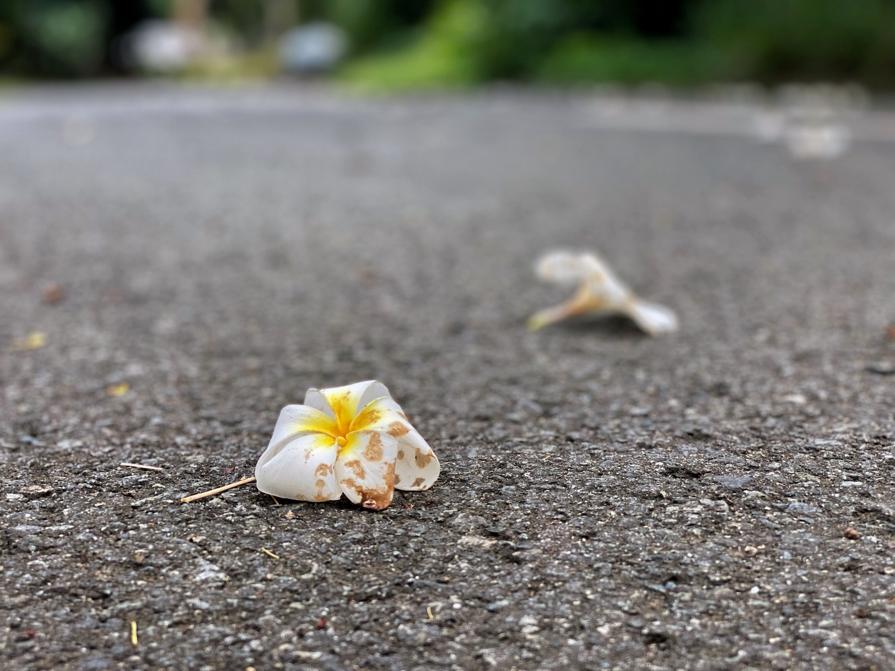
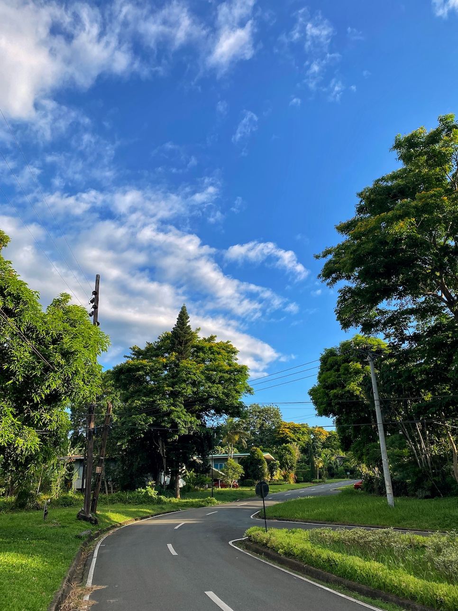
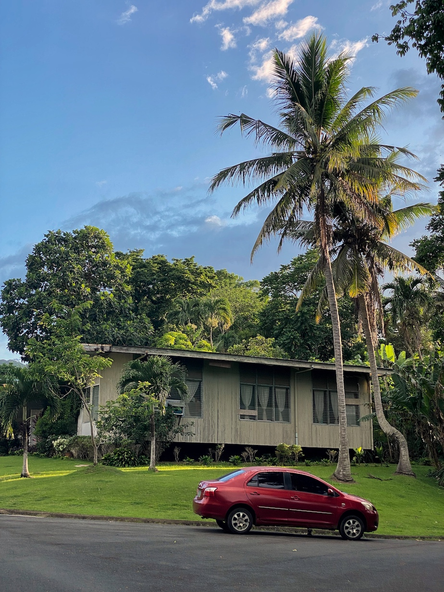
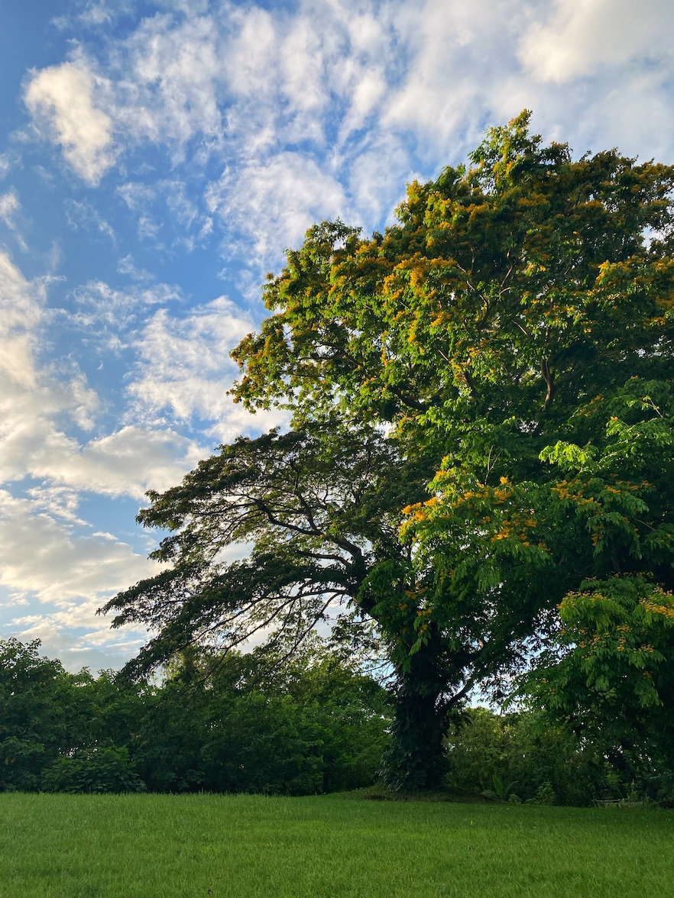
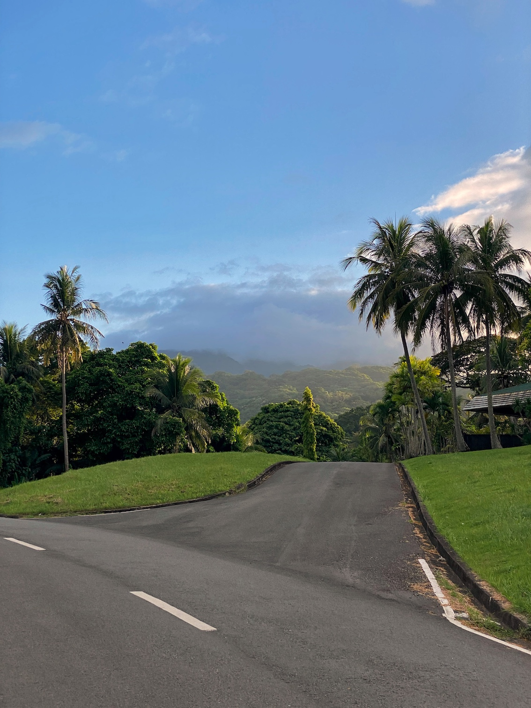
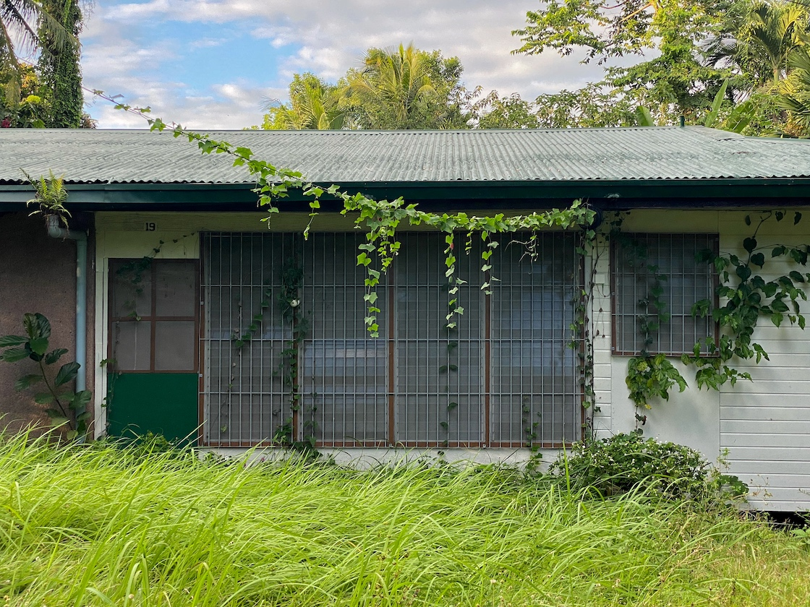
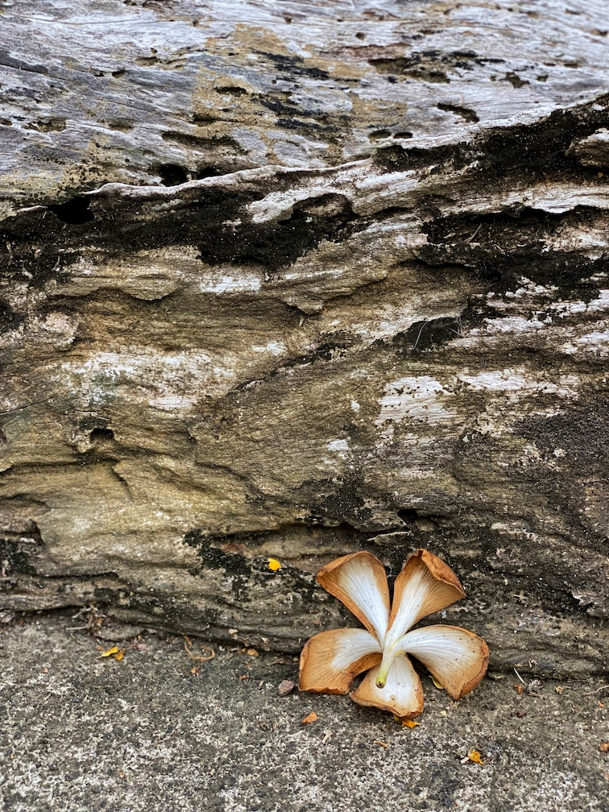


This piece is written in Filipino. If you want to receive an English translation, please reply to this email and let me know. Thank you.


Buhay na buhay ang mga kalachuchi sa loob ng campus. Nagkakandahulog ang mga bulaklak nila, pinamamalamutian ang mga kalsada't sidewalk at humahalimuyak sa sinumang napapadaan. Para bang humahalik lang sila sa lupa kapag nakita nilang may sumibol nang papalit sa kanila.

Marami akong nakikitang namumulaklak na puno ng kalachuchi ngayon, pero mahirap kalimutan ang isang tumubo malapit sa simbahan ng UCCP. Di hamak na mas malaki ito sa iba—mas mabulaklak. Sa tabi nito, nagbabaga ang dilaw na puno ng caballero. Ito kaya ang dahilan kung bakit tumatak sakin ang kalachuchi sa tabi niya?

 

Pagkaliko ko sa Narra, napansin ko ang nagkandahulog na mga prutas na mala-sineguelas. Galing sila sa pagkatayog-tayog na mga puno na nakalinya sa dulo ng library grounds. Ano ang mga punong ito? Napakarami kong [**hindi pa kilala sa kalikasan**](https://vinceimbat.com/a-mask-of-darkness-with-no-eyes/).

Bakit ba ako akit na akit sa paglalakad? Sa paghahanap nitong pakiramdam na hindi madaling maipaliwanag? Sa katahimikan at kapayapaan. At bakit ba bagaman akit na akit ako, parang nag-aalinlangan pa akong lumalim? Nakakulong pa rin ba ako rito sa paniniwalang wala sa pag-aaral ng kalikasan ang sagot sa kung paano ba mabuhay? Naniniwala pa rin ba ako na ang sagot ay nasa [**mga libro lamang**](https://vinceimbat.com/when-i-left-school-i-started-reading-a-lot/)?

Subalit, ang buhay ay mas arte kaysa sining. Napaka-subjective nito. Kailangan mo munang subukang mabuhay bago mo ito maintindihan. Kailangan mo muna itong maranasan bago mo ito maunwaan. Siguro nga hindi pansansibukuban ang mga katotohanang matatagpuan ko habang naglalakad sa kalyeng ito, subalit kung ito ang nagpapasaya sa akin, ano pang pangangatwiran ang kailangan ko bago gawin ito?

Ang tanong na [**“Paano ba mabuhay?”**](https://vinceimbat.com/how-to-live/) ay kapuwa masasagot ng karanasan at kaisipan. May puwang pa rin ang mga libro. Maari kang magbasa ng talambuhay at hawaan ang sarili mo ng karunungan. Subalit, dahil buhay ka na bago ka pa man matutong magbasa, wala kang magagawa kundi mabuhay upang matutong mabuhay. At yan ang mangyayari sa mas malaking parte ng maikling pamamalagi mo sa mundo—ang matuto sa mga pagsubok at pagkakamali. Wala tayong magagawa. Ito mismo ang heograpiya ng buhay.

Ang pagbabasa ay pandagdag kaalaman lamang. Maari tayong mabuhay nang hindi nagbabasa ng kahit na isang salita tulad ng nagawa ng mga ninuno natin. Ang pagbabasa ay isang teknolohiyang magpapagaan ng buhay. Pero kung hindi tayo maingat, maaari itong maging hadlang mismo sa pamumuhay. Kailangan mong mabuhay upang mabuhay.

Kinapanayam minsan ang pilosopong si [**Frédéric Gros**](https://www.theguardian.com/books/2014/apr/20/frederic-gros-walk-nietzsche-kant) tungkol sa libro niyang [**_Isang Pilosopiya ng Paglalakad_**](https://www.goodreads.com/book/show/18339944-a-philosophy-of-walking). Binanggit muna ng tagapanayam ang siping ito mula kay [**Thoreau**](https://vinceimbat.com/what-i-learned-from-a-year-of-reading-thoreaus-journal/):

> Ang pananaw ng nakararami ay mas mahinang maniniil kumpara sa pananaw natin sa ating sarili. Kung ano ang iniisip ng tao tungkol sa sarili niya, iyon ang magpapasiya, o sa halip magpapahiwatig, ng kapalaran niya.”

Pagkatapos, tinanong ng tagapanayam si Gros kung kung meron ba siyang isang pananaw sa sarili niya na kasalukuyang gumagapos sa kaniya. Matagal nanahimik ang pilosopo. Pagkaraan ng ilang minuto, sumagot siya: “Tinuruan ako ng mga librong isinulat ko kung paano umunawa, pero ang problem ay kung ano ang ikinubli nila mula sa akin. Ikinubli nila kung paano mabuhay.”

“Sa tingin mo ba mas magandang maglakad na lamang kaysa magsulat ng isang libro tungkol sa paglalakad?” tanong ng tagapanayam.

“Oo. Subalit, wala akong sapat na lakas ng loob.”

May maliit na pipit na kumakanta sa tuktok ng maliit na puno pagpasok ko sa Doña Aurora. Kumakanta ito habang papalapit ako sa kaniya. Sa mismong sandali na tumapat ako sa puno at lumingon sa kaniya, umipot ang ibon. Mga ganitong bagay lang naman ang matututunan mo [**kapag naglalakad**](https://vinceimbat.com/all-them-dirt-roads/) ka sa labas.

Sa dulo ng lakad ko, sa kalye ng Heliconia, may maliit na asong tumatahol sa akin. Nakatali siya sa tapat ng isang maliit na bahay na maakyat lamang gamit ng maliit na hagdan. Tumigil ako sandali at bumulong sa aking sarili, “Isa itong kakatuwang pangitain.”

